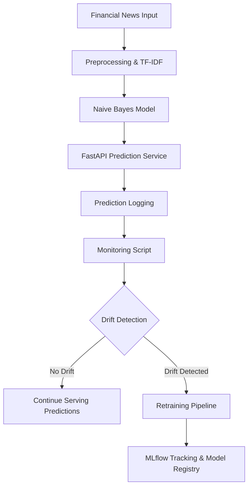

# Financial News Sentiment Analyzer (MLOps Project)

## Overview

This project builds a complete MLOps pipeline for sentiment classification of financial news headlines. Given a headline, the model predicts one of three classes — **positive**, **neutral**, or **negative** — using a TF-IDF vectorizer paired with a Multinomial Naive Bayes classifier.

**ML Task:** Text Classification (Sentiment Analysis)

---

## Problem Statement

Financial analysts and trading systems benefit from rapid, automated interpretation of news sentiment. Manual labeling is slow and does not scale with the volume of financial news produced daily. This project automates the sentiment prediction workflow, with full experiment tracking and CI/CD integration to support production-grade reliability.

---

## Architecture (Flowchart)



---

## Tech Stack

- **Core ML:** scikit-learn, TF-IDF Vectorizer, Multinomial Naive Bayes
- **Data Versioning:** DVC (`dvc.yaml`, `dvc.lock`)
- **Experiment Tracking:** MLflow (SQLite backend via `mlflow.db`)
- **CI/CD:** Jenkins (`Jenkinsfile`), GitHub Actions (`.github/workflows/`)
- **Containerization:** Docker (`Dockerfile`)
- **Serialization:** Pickle (`.pkl` model artifacts)
- **Language:** Python 3.x

---

## Dataset

**Financial PhraseBank** — a collection of financial news sentences manually annotated by domain experts into three sentiment classes: positive, neutral, and negative.

- Stored in the `/data` directory
- Versioned and tracked with DVC

---

## Repository Structure

```
ml-ci-project/
├── .dvc/                    # DVC configuration and cache metadata
├── .github/
│   └── workflows/           # GitHub Actions CI/CD pipeline
├── data/                    # Raw and processed dataset files
├── logs/                    # Training and pipeline logs
├── src/
│   ├── train.py             # Model training script
│   └── predict.py           # Inference / prediction script
├── .dvcignore
├── .gitignore
├── Dockerfile               # Container definition
├── Jenkinsfile              # Jenkins declarative pipeline
├── README.md
├── dvc.lock                 # Locked DVC pipeline state
├── dvc.yaml                 # DVC pipeline stage definitions
├── mlflow.db                # MLflow SQLite tracking store
└── requirements.txt         # Python dependencies
```

---

## CI/CD Pipeline

### GitHub Actions

Triggered automatically on every push. Installs dependencies and runs model training in a clean environment.

### Jenkins

Declarative pipeline with four sequential stages:

1. **Verify Files** — Lists the project root and `/data` directory to confirm the workspace is correctly populated.
2. **Setup Virtual Environment** — Creates a Python `venv` and installs all dependencies from `requirements.txt`.
3. **Train Model** — Activates the `venv` and executes `src/train.py` to train and serialize the classifier.
4. **Archive Model** — Archives all generated `.pkl` model artifacts with fingerprinting for traceability.

---

## MLOps Components

### MLflow — Experiment Tracking

All training runs are logged via MLflow using a local SQLite backend (`mlflow.db`). Tracked artifacts include model parameters, vectorizer configuration, and evaluation metrics (accuracy, per-class F1).

### DVC — Data & Pipeline Versioning

DVC manages pipeline reproducibility. `dvc.yaml` defines pipeline stages and their dependencies, while `dvc.lock` pins exact input/output hashes so any run can be reproduced identically.

---

## Local Setup

**1. Clone the repository:**
```bash
git clone https://github.com/suup1/ml-ci-project.git
cd ml-ci-project
```

**2. Create and activate a virtual environment:**
```bash
python -m venv venv
source venv/bin/activate        # macOS / Linux
venv\Scripts\activate           # Windows
```

**3. Install dependencies:**
```bash
pip install -r requirements.txt
```

**4. Train the model:**
```bash
python src/train.py
```

**5. Run inference:**
```bash
python src/predict.py "Markets rally after better-than-expected earnings"
```

---

## Docker

Build and run the containerized pipeline:

```bash
docker build -t ml-ci-project .
docker run ml-ci-project
```

---

## Generated Artifacts

- `models/*.pkl` — Serialized TF-IDF vectorizer and Naive Bayes classifier
- `mlflow.db` — SQLite database containing all MLflow run history, metrics, and parameters
- `logs/` — Pipeline execution and training logs

---

## Python Compatibility

Developed and tested on **Python 3.x**.
